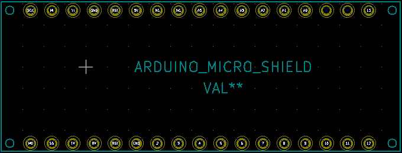

arduino_micro_shield
====================

KiCAD library and footprint for an Arduino Micro shield.

This is a component which represent the Arduino Micro pinout,
and a footprint for that component which maps to the surface area
and pinout of the Micro.

Pull requests very welcome!
